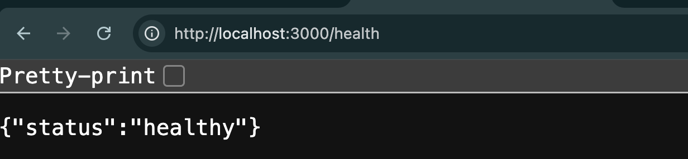
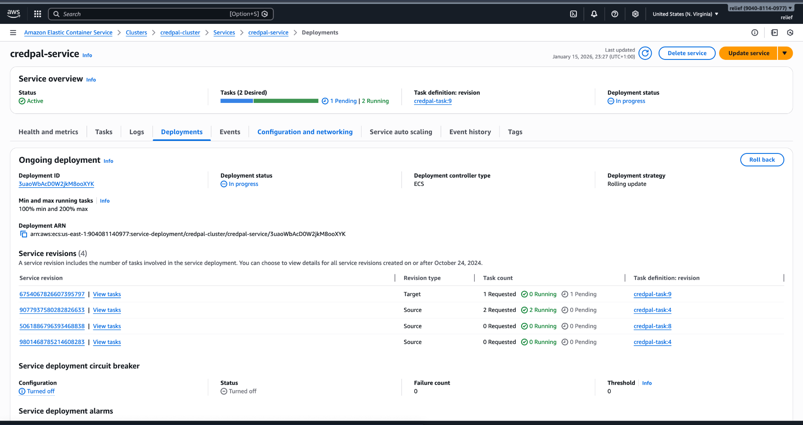

# CredPal DevOps Assessment – Production‑Ready CI/CD on ECS

> **Author:** Kehinde Abatan
> **Role:** DevOps Engineer (Assessment)
> **Focus:** Production‑grade containerization, CI/CD automation, and cloud infrastructure

---

## 👋 Why this repository exists

This repository is **not just a demo app**. It represents how I would **actually set up a production DevOps workflow** for a fast‑growing fintech like CredPal.

From the start, the goal was to:

* Build something **simple but realistic**
* Separate **local development concerns** from **production concerns**
* Favor **clarity and reliability** over over‑engineering
* Show **decision‑making**, not just tooling

Every choice here is intentional and explained.

---

## 🧩 Application Overview

A minimal Node.js API running on **port 3000** with three endpoints:

| Method | Endpoint   | Purpose                                                 |
| ------ | ---------- | ------------------------------------------------------- |
| GET    | `/health`  | Used for load balancer & service health checks          |
| GET    | `/status`  | Returns service metadata (used to validate deployments) |
| POST   | `/process` | Sample request handler (placeholder for business logic) |

This app is intentionally simple so the **DevOps architecture** remains the focus.

---

## 🏗 High‑Level Architecture

```text
Developer Push
     ↓
GitHub Actions (CI/CD)
     ↓
DockerHub (Image Registry)
     ↓
Amazon ECS (Fargate)
     ↓
Application Load Balancer
     ↓
Users
```

> 🧠 Key idea: **Infrastructure is stable; application delivery is continuous.**

---

## 🧪 Local Development (Docker Compose)

For local testing, the application runs with Docker Compose.

### Why Docker Compose?

* Fast onboarding for developers
* No cloud dependencies
* Easy teardown and reset

### Services used locally

* **Node.js app** (port 3000)
* **PostgreSQL** (data store)
* **Redis** (cache / placeholder)

> ⚠️ Docker Compose is used **only for local development**, not production.

### Run locally

```bash
docker-compose up --build
```

Test:

```bash
curl http://localhost:3000/health
```



---

## 🐳 Containerization Strategy

### Dockerfile principles

* Multi‑stage build (small final image)
* Non‑root runtime user
* Deterministic dependency installs (`npm ci`)

---

## 🚀 CI/CD Pipeline (GitHub Actions)

The pipeline is designed to **mirror real production flow**.

### What happens on every push to `main`

1. Install dependencies
2. Run a health check test
3. Build a Docker image
4. Tag image with commit SHA
5. Push image to DockerHub
6. Render a new ECS task definition
7. Trigger a rolling deployment

### CI/CD Visual Flow

```text
Code Push → Test → Build Image → Push Image → Update ECS → Rolling Deploy
```

> 🔐 Secrets are injected via **GitHub Secrets**. No credentials are committed to source control.


---

## 📦 ECS Deployment Model

### Task Definition Strategy

The repository contains a **base task definition template**:

```json
{
  "image": "IMAGE_PLACEHOLDER"
}
```

During deployment, the pipeline **injects the actual image tag dynamically**, creating a new task revision.

> This ensures:
>
> * Immutable deployments
> * Easy rollback
> * Full deployment history

---

## 🔁 Rolling Deployments & Zero Downtime

Deployments use ECS rolling updates behind an Application Load Balancer.

What this means in practice:

* New tasks start first
* Health checks must pass
* Old tasks drain gracefully
* Users never see downtime

### Deployment in progress (example)



---

## 🌐 Public Access

The application is exposed via an **Application Load Balancer DNS name**:

```text
http://<alb-dns-name>
```

Available endpoints:

* `/health`
* `/status`
* `/process`

> In production, HTTPS would be enabled using ACM and an HTTPS listener.


---

## 🔐 Security Considerations

### What is implemented

* Non‑root containers
* No secrets in GitHub
* Secrets injected at runtime
* Private networking for compute

### CI/CD authentication note

For this assessment, AWS credentials are injected into GitHub Actions via encrypted secrets to ensure reliable pipeline execution.

> In a production environment, this pipeline would use **GitHub OIDC with IAM role assumption** to eliminate long‑lived credentials.

This approach was explored during implementation and documented intentionally.

---

## 👀 Observability

* Health checks → ALB + ECS
* Deployment visibility → ECS service events

This provides **sufficient observability without over‑engineering**.

---

## 🧠 Key Design Decisions (Why this way?)

* **ECS over EC2** → safer deployments, less operational overhead
* **Managed databases in production** → RDS & ElastiCache (not containers)
* **Docker Compose only for local dev** → clean environment separation
* **CI/CD handles deployments, Terraform handles infra** → clear ownership

---

## 🔄 Rollback Strategy

If a deployment fails:

* ECS automatically keeps old tasks running
* Rollback is as simple as redeploying a previous task revision

No manual intervention required.

---

## 🧾 Final Notes

This repository reflects **how I think about DevOps in real systems**:

* Understand the failure modes
* Favor safety over shortcuts
* Automate the boring parts
* Keep the system explainable

Thanks for reviewing this submission.


